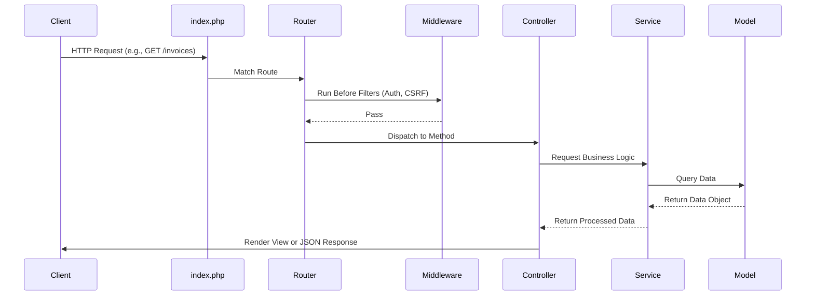
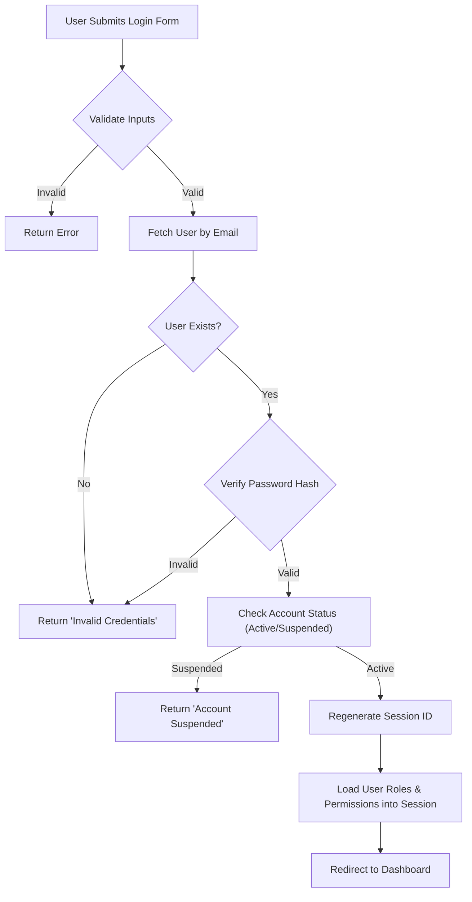
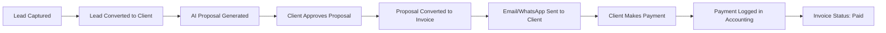
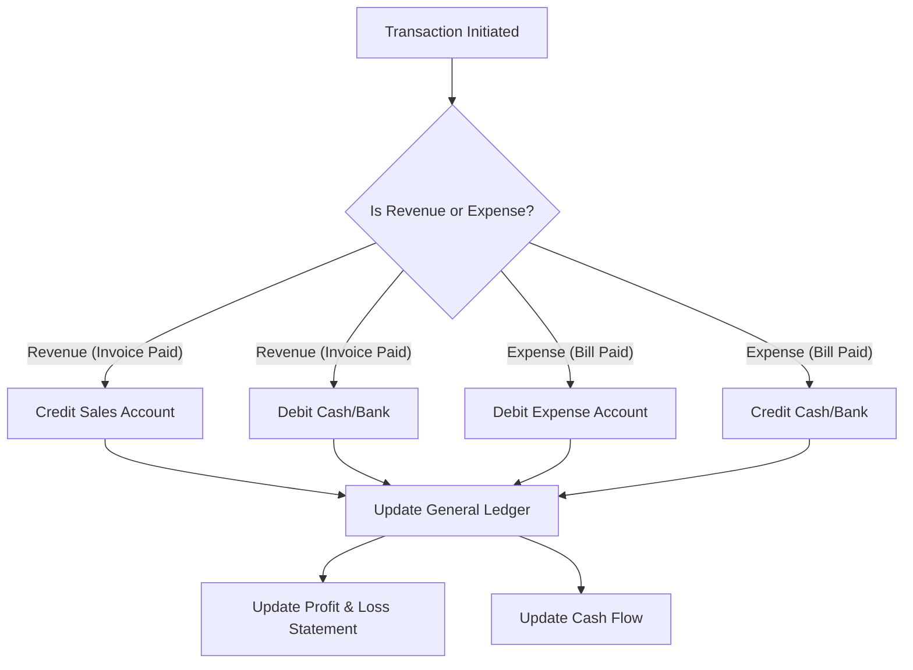
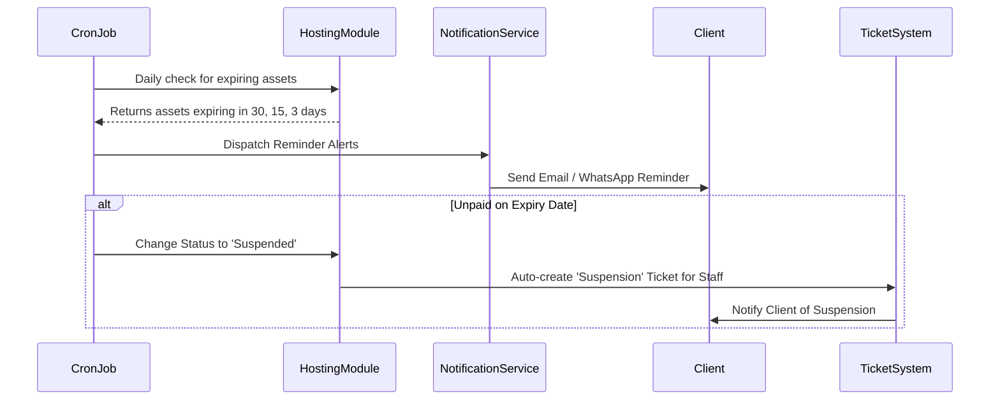
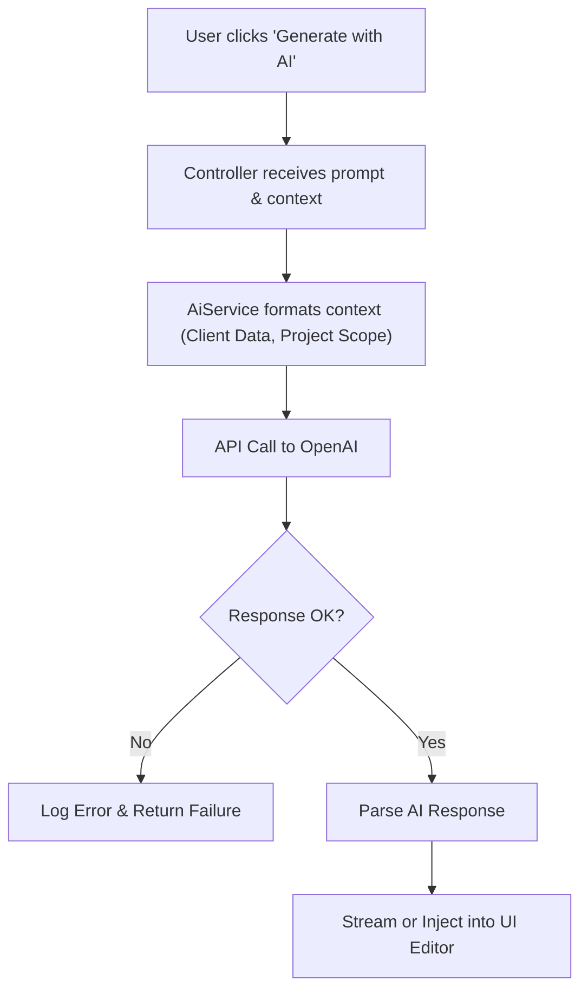
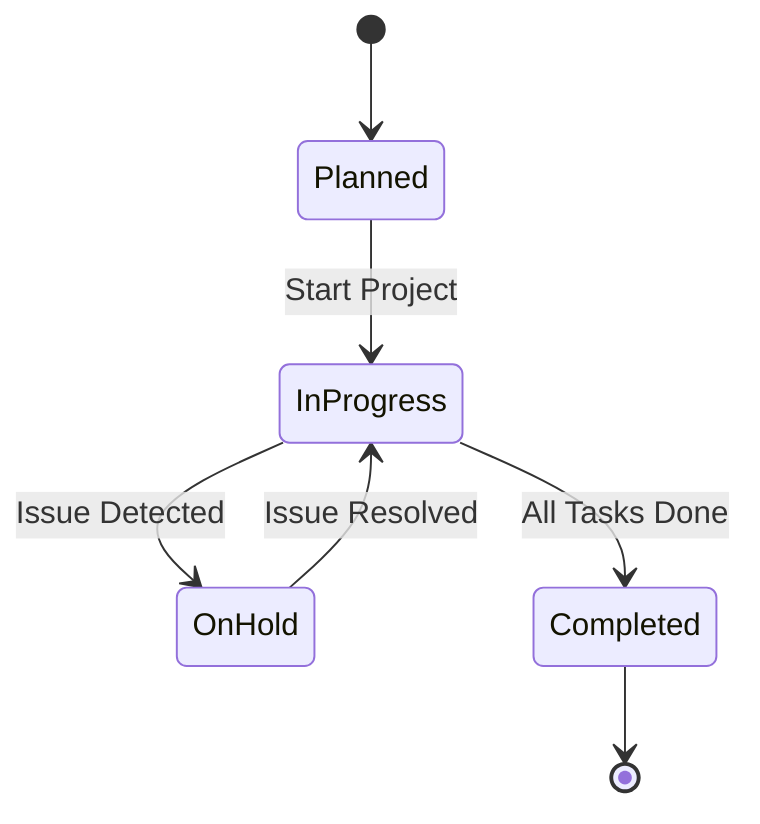

# System Architecture

Welcome to the **Sovryx OS** Architecture documentation. This document provides a deep dive into the internal design, patterns, and workflows that power the enterprise system.

## 🏗 High-Level Architecture Overview

Sovryx OS follows a classic **Model-View-Controller (MVC)** architectural pattern enriched with a **Layered Service Architecture**. This ensures the separation of concerns, scalability, and maintainability across all 20+ modules.

### The Layered Architecture

1. **Presentation Layer (View):** HTML5, Bootstrap 5, AJAX, DataTables, ApexCharts. Handles user interactions and presents data.
2. **Application Layer (Controller):** PHP 8.3+. Processes HTTP requests, enforces access control (RBAC), and delegates business logic to Services.
3. **Business Logic Layer (Service/Model):** Contains domain-specific business rules. Orchestrates complex operations like Invoice generation, AI integration, and Payroll calculation.
4. **Data Access Layer (Model/Database):** PDO, MySQL 8+. Manages data persistence, relations, and transactions.

---

## 📂 Folder Structure

```text
sovryx-os/
├── app/
│   ├── Controllers/       # HTTP Request handlers (e.g., InvoiceController, AuthController)
│   ├── Models/            # Database representations (e.g., User, Invoice, Project)
│   ├── Views/             # UI Templates (e.g., dashboard.php, invoices/list.php)
│   ├── Services/          # Complex business logic (e.g., AiProposalService, WhatsAppService)
│   ├── Middlewares/       # Request filters (e.g., RoleMiddleware, CsrfMiddleware)
│   ├── Helpers/           # Global utility functions (e.g., formatCurrency, sanitizeInput)
│   └── Exceptions/        # Custom exception handlers
├── config/                # Centralized configuration (database.php, app.php, mail.php)
├── database/
│   ├── migrations/        # Database schema definitions
│   └── seeders/           # Initial data population scripts
├── public/                # Publicly accessible directory
│   ├── index.php          # The Front Controller (Application entry point)
│   ├── assets/            # CSS, JS, images, compiled assets
│   └── uploads/           # User-uploaded files (documents, avatars)
├── routes/
│   ├── web.php            # Web interface routes (Session based)
│   └── api.php            # REST API routes (Token based)
├── storage/               # Application generated files (Logs, cache, PDF temp files)
├── tests/                 # Unit and Integration tests (PHPUnit)
├── vendor/                # Composer dependencies
├── .env                   # Environment variables
└── composer.json          # Dependency management configuration
```

---

## 🔄 Core Workflows

### 1. Request Flow Lifecycle

Every request in Sovryx OS flows through a predictable lifecycle:



### 2. Authentication Flow

Sovryx OS uses secure PHP sessions for web clients and Bearer Tokens for API access.



### 3. CRM to Invoice Flow

This demonstrates the journey from a Lead to a paid Invoice.



### 4. Accounting Flow

The accounting module strictly adheres to double-entry principles conceptually, ensuring all revenue and expenses map to the Chart of Accounts.



### 5. Hosting & Domain Flow (Automated)

Crucial for IT Companies to manage renewals automatically.



### 6. AI Integration Flow

Sovryx OS uses OpenAI's API to assist in drafting proposals, emails, and insights.



### 7. Project & Task Flow



## 🔐 Security Architecture

Sovryx OS employs a defense-in-depth strategy:
1. **Edge/Server Level:** Nginx/Apache configuration, HTTPS enforcement, Rate Limiting.
2. **Application Level:** MVC encapsulation, input sanitization, CSRF token validation on all POST/PUT/DELETE requests.
3. **Data Level:** PDO Parameterized queries to eliminate SQL injection, Argon2 hashing for passwords.
4. **Audit Level:** Every state-changing action logs the User ID, Action, Timestamp, and IP Address.

## 🚀 Scalability Design

While built on a monolithic architecture for simplicity and ease of deployment, the system is designed to scale:
- **Stateless API:** The REST API is entirely stateless, allowing horizontal scaling of the backend application servers.
- **Database Indexing:** Critical foreign keys and lookup columns are heavily indexed.
- **Service Isolation:** Complex services (like PDF generation or Email sending) can easily be moved to asynchronous queues (e.g., using RabbitMQ or Redis) in future versions.
