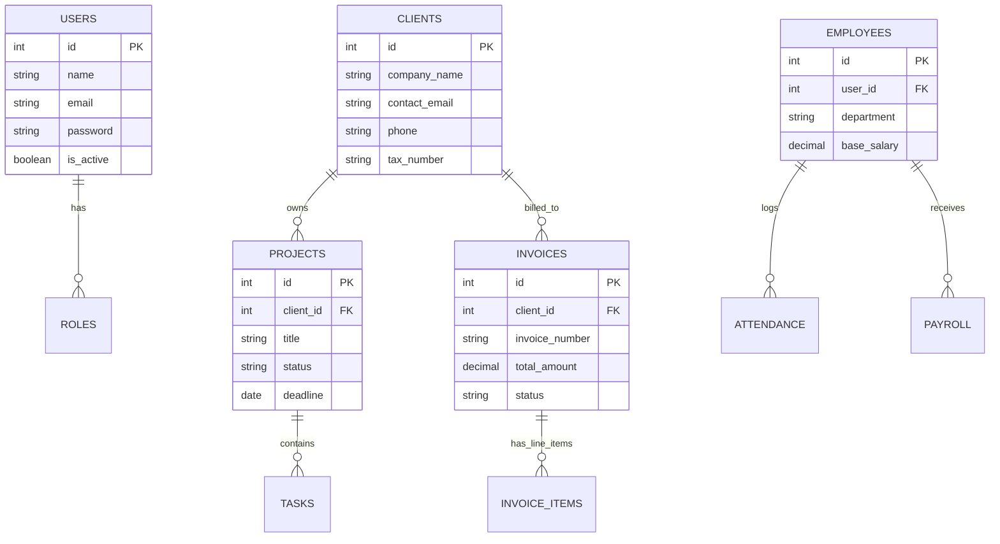

# Database Documentation

This document outlines the database architecture, conventions, and best practices for **Sovryx OS**. The database is built on **MySQL 8+** and is designed to be highly normalized, ensuring data integrity across all enterprise modules.

---

## 🏗 High-Level ER Diagram (Core Modules)

Below is a simplified Entity-Relationship diagram illustrating the core connections between Users, Clients, Projects, Invoices, and HR.

---

## 🗄 Core Tables & Relationships

### 1. Identity & Access Management
- **`users`**: Core authentication table.
- **`roles`**: Defines roles (e.g., Admin, Manager, Employee, Client).
- **`permissions`**: Granular access rights (e.g., `create_invoice`, `delete_project`).
- **`role_user`**: Pivot table for User <-> Role many-to-many relationship.
- **`permission_role`**: Pivot table for Role <-> Permission many-to-many relationship.

### 2. CRM & Sales
- **`clients`**: Stores company and contact details.
- **`leads`**: Potential clients. Includes source, status, and conversion tracking.
- **`quotations`**: Proposals sent to clients. Can be converted to Invoices.

### 3. Billing & Accounting
- **`invoices`**: Main invoice header. Relates to `clients`.
- **`invoice_items`**: Line items for invoices.
- **`payments`**: Records of payments received. Links to `invoices` and updates accounting balance.
- **`expenses`**: Outbound cash flow records. Categorized by expense types.
- **`chart_of_accounts`**: Standardized accounting ledger categories.

### 4. Project Management
- **`projects`**: High-level project containers.
- **`tasks`**: Individual actionable items. Relates to `projects` and assigned `users`.
- **`timesheets`**: Logs of time spent on tasks for billing and payroll.

### 5. HR & Payroll
- **`employees`**: Detailed HR information, links to the `users` table for system access.
- **`attendance`**: Daily clock-in/clock-out records.
- **`leaves`**: Leave requests and approval statuses.
- **`payroll`**: Generated salary slips, deductions, and bonuses.

### 6. IT Operations (Hosting & Domains)
- **`servers`**: Inventory of company or client servers.
- **`hostings`**: Hosting packages assigned to clients. Includes expiry dates.
- **`domains`**: Registered domains for clients. Includes registrar info and expiry dates.

---

## 🔑 Database Design Principles

### Normalization
The database is normalized to the **3rd Normal Form (3NF)**:
1. **1NF:** All attributes are atomic. No repeating groups.
2. **2NF:** All non-key attributes are fully functionally dependent on the primary key.
3. **3NF:** No transitive dependencies. (e.g., `client_address` is in `clients`, not duplicated in `invoices`).

### Primary & Foreign Keys
- **Primary Keys:** Every table uses an auto-incrementing unsigned integer `id` as the primary key.
- **Foreign Keys:** Relationships are strictly enforced using foreign key constraints. 

### Constraints & Cascading Actions
- **ON DELETE RESTRICT:** Used for critical financial records. You cannot delete a `client` if they have associated `invoices`. The system requires archiving or soft-deleting instead.
- **ON DELETE CASCADE:** Used for strictly dependent data. Deleting an `invoice` will cascade and delete its `invoice_items`.

### Indexes
Indexes are applied strategically to improve read performance:
- Primary and Foreign Keys are indexed automatically by MySQL.
- High-frequency search columns are indexed: `email` (users, clients), `status` (projects, tasks, invoices), `invoice_number` (invoices).
- Date columns used in reporting (e.g., `created_at`, `due_date`) have composite indexes where appropriate.

---

## 📝 Naming Conventions

Consistent naming is critical for maintainability:
- **Tables:** Plural, snake_case (e.g., `invoice_items`, `client_contacts`).
- **Primary Keys:** `id`.
- **Foreign Keys:** Singular table name + `_id` (e.g., `client_id`, `project_id`).
- **Boolean Fields:** Prefix with `is_` or `has_` (e.g., `is_active`, `has_attachments`).
- **Timestamps:** Standard `created_at`, `updated_at`, and `deleted_at` (for soft deletes).

---

## 🔄 Migration Strategy

Sovryx OS uses a custom migration runner (or a standard library like Phinx/Laravel Migrations if adapted) to manage schema changes.
- **Version Control:** All database schema changes must be written as migration classes.
- **Rollbacks:** Every `up()` migration must have a corresponding `down()` method to revert changes.
- **Execution:** Never modify the production schema manually. Always run `php sovryx migrate`.

---

## 🛡 Backup Strategy

Data loss is unacceptable for an ERP system.
1. **Automated Cron Backups:** A daily cron job dumps the entire MySQL database using `mysqldump`.
2. **Encryption:** Dumps are compressed and encrypted before storage.
3. **Off-site Storage:** Backups are securely transferred to off-site storage (e.g., AWS S3 bucket) via the application's backup service.
4. **Retention Policy:** Daily backups retained for 30 days. Weekly backups for 6 months.

## 📈 Optimization Best Practices
- Avoid `SELECT *`. Only query required columns.
- Use eager loading in the application layer to prevent N+1 query problems.
- Regularly monitor slow query logs in MySQL.
- Periodically run `OPTIMIZE TABLE` on high-churn tables like `audit_logs` or `sessions`.
