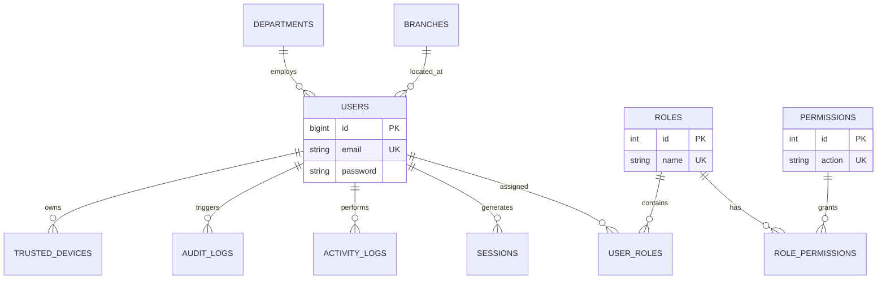
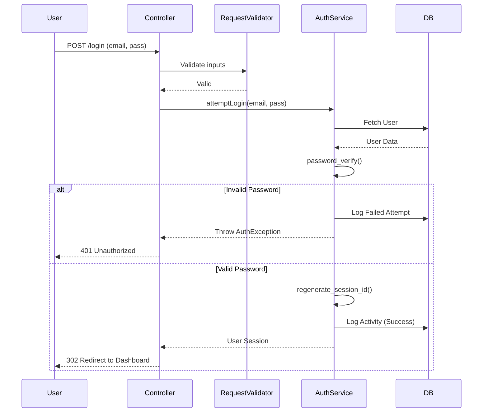

# 🔐 Identity, Authentication & User Management Module

*Sovryx OS - Enterprise Business Operating System*

---

## 1. ✔️ Business Requirements

The Authentication and User Management module serves as the highly secure, foundational gateway for **Sovryx OS**. As an ERP handling sensitive financial, CRM, and HR data, the business requires a centralized identity provider. 
- **Centralized Access Control:** Must ensure that every user (Employee, Client, Vendor) has a single unified identity but strict boundary controls.
- **Compliance & Auditing:** The business requires immutable audit logs of all access attempts, privilege escalations, and data modifications to meet international compliance standards (GDPR, ISO 27001).
- **Scalability:** The architecture must seamlessly support multi-tenancy (SaaS) and hundreds of thousands of concurrent sessions without bottlenecking the application layer.

---

## 2. ✔️ Functional Requirements

The module must support the following enterprise functionalities:
- **Identity Verification:** Login, Registration, OTP, 2FA (Google Authenticator), Email/Phone Verification.
- **Session Control:** Multiple device login tracking, forced logout from all devices, trusted device whitelisting, session timeout.
- **User Lifecycle Management:** Create, Update, Suspend, Deactivate, Restore, Bulk Import/Export, Advanced Searching.
- **Role-Based Access Control (RBAC):** Dynamic creation of Roles, granular assignment of Module/Page/Field level permissions.
- **Organization Mapping:** Tying users to specific Branches, Departments, and Teams.
- **Audit & Security:** Immutable Activity Logs, Audit Logs, Brute Force protection, IP Whitelisting/Blacklisting, Password Expiration logic.

---

## 3. ✔️ Non-Functional Requirements

- **Performance:** Login validation must complete in under 200ms. Database indexes must support rapid searching of millions of audit logs.
- **Security:** Zero plaintext storage of sensitive credentials. Protection against CSRF, XSS, and SQLi by default.
- **Availability:** Stateless session architecture (Redis) to allow load balancing across multiple server instances.
- **Maintainability:** 100% adherence to SOLID principles, PSR-12 coding standards, and Clean Architecture.

---

## 4. ✔️ UI Design

The UI will be built using Bootstrap 5, customized with the Sovryx OS enterprise theme (Dark Mode ready).

**Key Screens:**
- **Auth Portal:** Centered card layout for Login/Forgot Password. Floating labels, password visibility toggle, CAPTCHA integration.
- **Security Dashboard:** High-level widgets showing *Total Users*, *Active Sessions*, *Failed Logins (24h)*, and *Recent Security Alerts*.
- **User Directory:** DataTables.js implementation featuring server-side processing, column visibility toggles, and complex filters (by Role, Department, Status).
- **RBAC Matrix:** A massive HTML table (with sticky headers) allowing Admins to check/uncheck permissions across roles horizontally.
- **Modals:** SweetAlert2 for destructive actions (e.g., "Are you sure you want to suspend this user?"). Bootstrap Modals for quick user creation.

---

## 5. ✔️ Database Design

The database is normalized (3NF) to ensure data integrity.

**Core Tables:**
- `users`: `id`, `emp_id`, `name`, `email`, `phone`, `password`, `status`, `department_id`, `branch_id`, `two_factor_secret`, `last_login_at`.
- `roles`: `id`, `name`, `is_system_default`.
- `permissions`: `id`, `module`, `action` (e.g., `invoice.create`).
- `role_permissions`: `role_id`, `permission_id`.
- `user_roles`: `user_id`, `role_id`.

**Security & Tracking Tables:**
- `sessions`: `id`, `user_id`, `ip_address`, `user_agent`, `payload`, `last_activity`.
- `failed_logins`: `id`, `ip_address`, `email_attempted`, `attempted_at`.
- `trusted_devices`: `id`, `user_id`, `device_signature`, `trusted_until`.
- `activity_logs`: `id`, `user_id`, `action_type`, `description`, `ip_address`, `created_at`.
- `audit_logs`: `id`, `user_id`, `table_name`, `record_id`, `old_values` (JSON), `new_values` (JSON), `created_at`.
- `password_resets`: `email`, `token`, `created_at`.
- `email_verifications`: `email`, `otp`, `expires_at`.

---

## 6. ✔️ ER Diagram



---

## 7. ✔️ Folder Structure

```text
modules/Authentication/
├── Config/
│   └── auth.php
├── Controllers/
│   ├── Api/
│   │   └── AuthApiController.php
│   ├── Web/
│   │   ├── LoginController.php
│   │   ├── RoleController.php
│   │   ├── UserController.php
│   │   └── SecurityDashboardController.php
├── Models/
│   ├── User.php
│   ├── Role.php
│   ├── Permission.php
│   └── AuditLog.php
├── Repositories/
│   ├── Interfaces/
│   │   └── UserRepositoryInterface.php
│   ├── UserRepository.php
│   └── RoleRepository.php
├── Services/
│   ├── AuthenticationService.php
│   ├── TwoFactorService.php
│   └── AuditLoggerService.php
├── Requests/
│   ├── StoreUserRequest.php
│   └── LoginRequest.php
├── Middleware/
│   ├── RequireTwoFactor.php
│   ├── CheckPermission.php
│   └── ThrottleLogins.php
├── Routes/
│   ├── web.php
│   └── api.php
├── Views/
│   ├── auth/
│   │   ├── login.php
│   │   └── 2fa_challenge.php
│   └── users/
│       ├── index.php
│       ├── rbac_matrix.php
│       └── profile.php
└── Database/
    ├── Migrations/
    └── Seeders/
```

---

## 8. ✔️ Controllers

Controllers are kept strictly "skinny". They only parse HTTP requests, pass DTOs (Data Transfer Objects) to Services, and return HTTP responses.
- `LoginController`: Handles the GET request for the login page and the POST request to submit credentials.
- `UserController`: Handles CRUD operations for employees/clients.
- `RoleController`: Handles the matrix UI for assigning permissions.

---

## 9. ✔️ Models

Models extend the base ORM. They define relationships and encapsulate mutators (e.g., automatically hashing a password when the `password` attribute is set).
- `User`: Contains methods like `hasPermission($permission)`, `isActive()`, and `assignRole($role)`.

---

## 10. ✔️ Services

The Service layer contains all heavy business logic.
- `AuthenticationService`: Handles verifying passwords via `password_verify()`, regenerating session IDs, logging failed attempts, and enforcing IP whitelists.
- `AuditLoggerService`: Captures the `before` and `after` states of any database model and asynchronously writes to `audit_logs`.
- `TwoFactorService`: Integrates with Google Authenticator (TOTP) to verify 6-digit codes.

---

## 11. ✔️ Repositories

The Repository Pattern abstracts database queries, making the application database-agnostic and easily testable.
- `UserRepository`: Implements `UserRepositoryInterface`. Contains methods like `findByEmail(string $email)`, `getPaginatedUsers(array $filters)`, and `suspendUser(int $id)`.

---

## 12. ✔️ Routes

**Web Routes (Protected by CSRF & Session Middleware):**
- `GET /login`
- `POST /login`
- `POST /logout`
- `GET /admin/users` (Requires `view_users` permission)
- `POST /admin/users/bulk-suspend`

**API Routes (Protected by Bearer Tokens):**
- `POST /api/v1/auth/token`
- `GET /api/v1/users/me`

---

## 13. ✔️ Views

Utilizing a templating engine (or raw PHP with strict escaping).
- `login.php`: Clean, distraction-free UI.
- `users/index.php`: Contains a dynamic DataTable initializing via AJAX to `UserController@getDatatable`.
- `rbac_matrix.php`: A visual grid connecting `Roles` (Columns) to `Permissions` (Rows).

---

## 14. ✔️ APIs

### `POST /api/v1/auth/login`
**Request Body:**
```json
{
  "email": "ceo@sovryxtech.com",
  "password": "SecurePassword123!",
  "device_name": "iPhone 14"
}
```
**Response (200 OK):**
```json
{
  "success": true,
  "token": "1|abc123xyz...",
  "user": {
    "id": 1,
    "name": "Super Admin",
    "roles": ["super_admin"]
  }
}
```
*Handles 429 Too Many Requests on Brute Force, and 401 Unauthorized on bad credentials.*

---

## 15. ✔️ Permissions

Sovryx OS uses granular string-based permissions checked via the `CheckPermission` middleware.
- `user.create`, `user.edit`, `user.delete`, `user.suspend`
- `role.manage`, `audit.view`, `security.manage`

---

## 16. ✔️ Workflows

### Standard Login Flow


---

## 17. ✔️ Security Implementation

- **Password Hashing:** `password_hash($pass, PASSWORD_ARGON2ID)`.
- **Session Security:** `session_regenerate_id(true)` mitigates session fixation. Cookies are set to `HttpOnly`, `Secure`, and `SameSite=Strict`.
- **Rate Limiting:** IP addresses failing login 5 times within 1 minute are locked out for 15 minutes.
- **SQL Injection:** Strict use of PDO prepared statements in the Repository layer. No raw queries allowed.
- **XSS:** Data output in views is wrapped in `htmlspecialchars($var, ENT_QUOTES, 'UTF-8')`.

---

## 18. ✔️ Testing Strategy

- **Unit Tests:** Test `TwoFactorService` logic with dummy secrets to ensure code validation passes/fails correctly.
- **Feature Tests:** HTTP test simulating a POST to `/login` with valid credentials, asserting that the session contains the user ID and a redirect occurs.
- **Security Tests:** Simulate 6 rapid failed logins and assert that the 6th attempt returns a `429 Too Many Requests`.

---

## 19. ✔️ Deployment Guide

1. Ensure the web server (Nginx/Apache) denies direct access to the `modules/` directory.
2. In production, configure Redis as the session driver (`SESSION_DRIVER=redis`) in `.env` to allow session sharing across load-balanced servers.
3. Run `php sovryx migrate` to generate the Auth tables, followed by `php sovryx db:seed --class=RoleSeeder` to establish the Super Admin role.

---

## 20. ✔️ Future Improvements

- **OAuth 2.0 / SSO:** Allow users to log in using Microsoft Azure AD or Google Workspace.
- **WebAuthn / Passkeys:** Replace passwords entirely with biometric authentication (FaceID / TouchID).
- **AI Anomaly Detection:** Machine learning service that analyzes login locations and times, automatically triggering an OTP challenge if a login occurs from an unusual geographic location.
